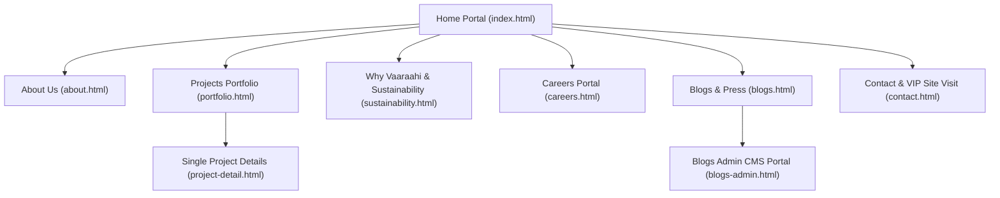

# Vaaraahi Group of Estates — Master Project Architecture & Interactive Guide

---

## 🏛️ 1. Project Overview & Vision

**Vaaraahi Group of Estates** is a premier luxury real estate development platform showcasing high-end residential developments across **Telangana and Andhra Pradesh** (specifically **Hyderabad, Rayachoty, Proddatur, and Jammalamadugu**).

### Core Brand Pillars:
1. **15+ Years of Proven Trust:** Over 1,000+ happy families and 1.5M+ Sq.Ft of delivered developments.
2. **100% Legal Transparency & Governance:** 40-year clear title forensic vetting with RERA and APF clearances from SBI, HDFC, and ICICI Bank.
3. **Engineered Longevity (100+ Year Lifespan):** Fe-550D TMT steel rebar, computer-batched M35 concrete, and Porotherm clay insulation blocks.
4. **Bioclimatic Science & Sacred Vastu Geomancy:** Architecturally planned for natural light, wind circulation, and 5°C cooler indoor ambient temperatures.
5. **Eco Stewardship:** 40% dedicated green spaces, subterranean rainwater percolation aquifers, and solar microgrid arrays.

---

## 🧭 2. Complete Sitemap & Navigation Blueprint

---

## 📄 3. Detailed Page Directory: Where Every Page Takes You

| Page | File | Purpose & Experience | Where It Takes You / Key Actions |
| :--- | :--- | :--- | :--- |
| **Home Portal** | [index.html](file:///c:/Users/91900/Desktop/vamshi/vaarahi/index.html) | The flagship interactive experience center featuring 3D WebGL graphics, architectural tools, calculators, transit radars, and live metrics. | Explores 3D models, calculates mortgage/ROI, inspects BIM cutaways, and books VIP chauffeur tours. |
| **About Us & Heritage** | [about.html](file:///c:/Users/91900/Desktop/vamshi/vaarahi/about.html) | The 15-year legacy story of Vaaraahi Group, leadership manifesto, executive board, construction philosophy, and timeline. | Leads to project portfolio, sustainability standards, and contact enquiry. |
| **Projects Portfolio** | [portfolio.html](file:///c:/Users/91900/Desktop/vamshi/vaarahi/portfolio.html) | Comprehensive real estate inventory with live filtering (*All, Luxury Villas, Gated Enclaves, Commercial/Plots*), regional locator, and drone flythroughs. | Clicking any project card navigates directly to [project-detail.html](file:///c:/Users/91900/Desktop/vamshi/vaarahi/project-detail.html). |
| **Project Details Deep-Dive** | [project-detail.html](file:///c:/Users/91900/Desktop/vamshi/vaarahi/project-detail.html) | Comprehensive showcase of a single landmark (*e.g., Vaaraahi Siri Meadows*): 4-level 3D floor cutaways, room dimensions, master layout, video tour, and bank APF sheet. | Download full Project Brochure PDF, schedule a private walk-through, or book a unit. |
| **Why Vaaraahi & Sustainability** | [sustainability.html](file:///c:/Users/91900/Desktop/vamshi/vaarahi/sustainability.html) | Dedicated engineering and governance proof hub: forensic 5-pillar vault, 3D scrollytelling, bioclimatic science, and 300-point zero-snag verification checklist. | View engineering test certifications, inspect green credits, and verify RERA licenses. |
| **Careers Portal** | [careers.html](file:///c:/Users/91900/Desktop/vamshi/vaarahi/careers.html) | Human capital and talent recruitment platform detailing company culture, benefits, employee perks, and live job openings. | Applicants can click *"Apply Now"* to submit their resume, portfolio, and details via an interactive modal. |
| **Blogs & Press Insights** | [blogs.html](file:///c:/Users/91900/Desktop/vamshi/vaarahi/blogs.html) | Public knowledge repository featuring architectural guides, market appreciation trends, AP/TG highway development news, and Vastu science. | Read complete articles, filter by category (*Architecture, Legal, Investment*), and navigate to Admin. |
| **Blogs Admin CMS Portal** | [blogs-admin.html](file:///c:/Users/91900/Desktop/vamshi/vaarahi/blogs-admin.html) | Secure internal Content Management System (CMS) with PIN authentication gate (`PIN: 1984` or master access). | Allows administrators to create, edit, delete, and publish live blog articles instantly with `localStorage` persistence. |
| **Contact & Experience Centers** | [contact.html](file:///c:/Users/91900/Desktop/vamshi/vaarahi/contact.html) | Physical hub locator for corporate offices (*Hyderabad, Proddatur, Rayachoty, Jammalamadugu*), phone directory, and interactive appointment desk. | Schedule an in-person meeting, request chauffeur pickup, or start an instant WhatsApp conversation. |

---

## 🛠️ 4. Inventory of All Interactive Tools & Mechanisms

Every section across the website is built with a custom tactile interactive tool (Zero static text):

### 1. 🌟 Hero 3D WebGL Architectural Villa Stage
* **What it does:** Renders a real-time 3D modernist duplex villa with warm glowing glass facades, illuminated infinity pool, vertical louvers, and rooftop solar pergola.
* **Interactive Controls:** 
  * **Atmospheric Light Rig:** Switch between **Golden Hour** (warm amber), **Zenith** (noon daylight), and **Dusk** (twilight with glowing room lights).
  * **Mouse Parallax & Scroll Scrub:** The camera smoothly orbits and dollies up into the sky as you scroll.

### 2. 📊 Vaaraahi Regional Scale & Impact Hub
* **What it does:** Displays verified delivery metrics across our growth corridors.
* **Interactive Controls:** Click between **All Regions, Rayachoty, Proddatur, Jammalamadugu,** or **Hyderabad** to see dynamically recalculated delivered square footage, inhabitant families, and landmark enclaves.

### 3. 🏢 3D Exploded Villa Structural Architecture & Floor Inspector
* **What it does:** Breaks down a 4-level luxury triplex villa into separate floating architectural layers.
* **Interactive Controls:** Click **"Explode 3D Floors"** or select **Level 03 (Sky Lounge), Level 02 (Master Suites), Level 01 (Grand Living),** or **Foundation** to inspect room sizes, material highlights, and square footage.

### 4. 🧭 Interactive Vastu & Bioclimatic Alignment Compass
* **What it does:** Bridges ancient Indian Vastu Shastra geomancy with modern thermal science.
* **Interactive Controls:** Click any of the 8 cardinal points (**Ishanya / NE, Purva / E, Agni / SE, Dakshina / S, Nairuthi / SW, Pashchima / W, Vayavya / NW, Uttara / N**) to inspect which room zone belongs there and why.

### 5. 🎠 3D Curved Architectural Showcase Carousel
* **What it does:** Displays flagship villas (*Vaaraahi Grandeur, Elite Vistas, Green Meadows, Signature Towers*) in an orbital 3D card ring.
* **Interactive Controls:** Click arrows, drag the track, or swipe to rotate through projects with direct pricing and **"Explore 3D Unit"** deep links.

### 6. 🛰️ Interactive 3D Regional Map & Drone Flythrough
* **What it does:** Visualizes geographic locations across Andhra Pradesh & Telangana on a 3D terrain canvas.
* **Interactive Controls:** Click **Rayachoty, Proddatur, Jammalamadugu,** or **Hyderabad HQ** to fly the virtual drone camera directly to that hub.

### 7. 🔬 Bioclimatic Structure & Material Deep-Dive
* **What it does:** Interactive cross-section blueprint of a luxury villa.
* **Interactive Controls:** Click on 6 hotspot pins (**Porotherm Terracotta Blocks, Fe-550D Steel, M35 Concrete, Double Glazed UPVC, Percolation Aquifers, Rooftop Solar**) to inspect thermal performance, U-values, and durability metrics.

### 8. ☀️ 24-Hour Solar & Lighting Simulator
* **What it does:** Simulates how sunlight and ambient architectural lighting transform the villa throughout the day.
* **Interactive Controls:** Click **Dawn (6:30 AM), Noon (12:00 PM), Golden Hour (5:30 PM),** or **Night (9:00 PM)** to watch real-time lighting shaders and glowing window overlays transition.

### 9. 🔲 Blueprint Vision vs. Completed Reality (Before/After Slider)
* **What it does:** Proves construction execution fidelity.
* **Interactive Controls:** Drag the interactive center divider handle left/right to compare the original 3D BIM render against the completed handover photograph.

### 10. 💰 Smart Mortgage & 10-Year ROI Wealth Calculator
* **What it does:** Empowers prospective buyers and investors to plan their finances.
* **Interactive Controls:** 
  * Switch between **Monthly EMI** and **10-Year Wealth Growth (ROI)**.
  * Adjust sliders for Property Price (₹45L — ₹4.5Cr), Down Payment (10% — 50%), Loan Tenure (5 — 30 Yrs), and Appreciation Rate (6% — 18%).
  * Real-time calculation of EMI, total interest, and projected 5-year/10-year asset valuation.

### 11. 🛣️ Regional Transit & Highway Corridor Navigator
* **What it does:** Visualizes real-time drive times and expressway connections from Vaaraahi enclaves.
* **Interactive Controls:** Click along route waypoints (**NH-44 Highway, Airport Corridor, IT Tech Hub, Hospital City, Bengaluru Highway**) to reveal drive durations, route distances, and road specifications.

### 12. 🏘️ 3D Isometric Community Masterplan Navigator
* **What it does:** Explores gated township infrastructure.
* **Interactive Controls:** Click hotspots on the aerial isometric layout to inspect the **15,000 Sq.Ft Clubhouse, 40% Green Park, 40-Ft Avenues,** and **Multi-Tier Security Gateway**.

### 13. 🛡️ Forensic Proof & Integrity Console
* **What it does:** Tabbed legal and engineering due-diligence vault.
* **Interactive Controls:** Switch between 5 pillars (**1. Trust & Clear Titles, 2. Engineered Quality, 3. 100% Transparency, 4. Eco Responsibility, 5. Vastu Precision**) to inspect bank APF letters, soil test certificates, and RERA approval seals.

### 14. 🎙️ Resident Voice Testimonial Hub
* **What it does:** Authentic homeowner stories.
* **Interactive Controls:** Filter by community or NRI buyers, and click the interactive **Play button** on simulated audio voice notes with dynamic equalizer waveforms.

### 15. 🎫 VIP Site Visit & Chauffeur Booking Desk
* **What it does:** Direct appointment scheduler at the bottom of the page.
* **Interactive Controls:** Choose your preferred time slot (**Morning, Afternoon, Sunset**), enter contact information, select your project of interest, and confirm your pass with complimentary chauffeur pickup.

### 16. ⚡ Floating Quick-Action Dock
* **What it does:** Pinned to the bottom-right corner across the entire website.
* **Interactive Controls:**
  * **"Book Site Visit":** Smoothly scrolls to or opens the appointment booking form.
  * **WhatsApp Icon:** Instantly opens a direct WhatsApp chat with an executive relationship manager.

---

## 🎨 5. Design System & Aesthetics Summary

* **Typography:** Stately high-end serif `Playfair Display` for headlines paired with crisp, clean `Plus Jakarta Sans` for body and UI elements.
* **Color Palette:**
  * Deep Emerald & Forest Green (`#06140E`, `#0B2518`, `#143626`): Evoking prestige, nature, and sacred geomancy.
  * Champagne Gold & Metallic Amber (`#C5A059`, `#D4AF37`, `#FFCA60`): Representing architectural excellence and luxury.
  * Crisp Ivory & Soft White (`#EDE5D8`, `#FFFFFF`): Clean readability and modernism.
* **Micro-Animations:** Fluid magnetic glider on nav links, custom luxury cursor with trail follower, smooth Barba.js curtain shutter transitions between pages, and specular gold hover sweeps.
